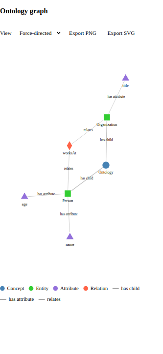
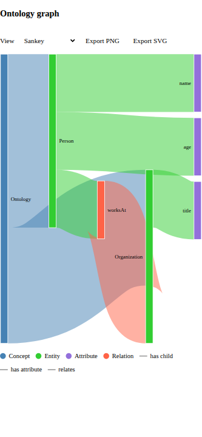
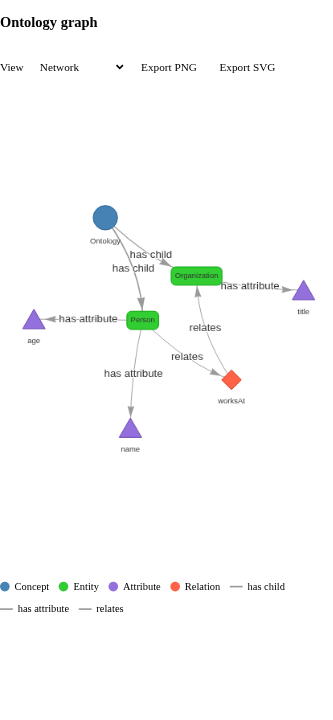

# GraphVisualization

Interactive visualisation of an ontology graph with three interchangeable views.

```svelte
<script lang="ts">
	import GraphVisualization from '$lib/components/visualization/GraphVisualization.svelte';
	import type { GraphData } from '$lib/components/visualization';

	const data: GraphData = {
		nodes: [
			{ id: '1', label: 'Ontology', type: 'concept' },
			{ id: '2', label: 'Person', type: 'entity', parent: '1' }
		],
		edges: [{ id: 'e1', from: '1', to: '2', label: 'has child' }]
	};
</script>

<GraphVisualization
	{data}
	title="Ontology"
	height={600}
	onNodeClick={(node) => console.log(node)}
/>
```

## Props

| Prop                | Type                               | Default                 | Description                                             |
| ------------------- | ---------------------------------- | ----------------------- | ------------------------------------------------------- |
| `data`              | `GraphData`                        | —                       | Nodes and edges. Dangling edges are dropped internally. |
| `width`             | `number \| string`                 | `'100%'`                | Number values are treated as pixels.                    |
| `height`            | `number \| string`                 | `600`                   | Number values are treated as pixels.                    |
| `title`             | `string`                           | `'Graph Visualization'` | Heading and `aria-label` of the SVG.                    |
| `visualizationType` | `'force' \| 'sankey' \| 'network'` | `'force'`               | Bindable; the toolbar switches it at runtime.           |
| `options`           | `Record<string, unknown>`          | `{}`                    | Extra options forwarded to vis-network.                 |
| `styles`            | `GraphStyles`                      | `{}`                    | Colour / size / shape overrides, globally or per type.  |
| `enableTooltips`    | `boolean`                          | `true`                  | Hover tooltips for nodes and edges.                     |
| `enableZoom`        | `boolean`                          | `true`                  | Zoom and pan (also enables vis-network drag view).      |
| `showLegend`        | `boolean`                          | `true`                  | Legend of node types and relations.                     |
| `showToolbar`       | `boolean`                          | `true`                  | View selector, export buttons, "Expand all".            |

### Callbacks

`onNodeClick(node, event)`, `onEdgeClick(edge, event)`, `onNodeHover(node, event)`, `onEdgeHover(edge, event)`.

### Exported methods

Bind the component with `bind:this` to call them:

- `toggleCollapse(id)` — collapse or expand the subgraph of a node (also available by double-clicking a node).
- `exportToPNG(filename | ExportOptions)` / `exportToSVG(filename | ExportOptions)` — `ExportOptions` accepts `filename`, `width`, `height` and `scale` (resolution multiplier).

## Styling

`styles.node` applies to every node, `styles.node.byType` per `NodeType`, and a node's own
`color` / `size` / `shape` fields win over both. Edge width is multiplied by `√value`, so
weighted graphs read correctly in the Sankey view. Defaults live in `graph.ts`
(`DEFAULT_NODE_STYLES`, `DEFAULT_EDGE_STYLE`) and the component's own CSS uses the design-system
custom properties from `src/app.css`.

## Implementation notes

- D3 (`d3`, `d3-sankey`) and `vis-network` are loaded with dynamic `import()` inside `onMount`,
  so the component is SSR safe.
- Above 500 nodes the force layout is ticked synchronously and vis-network physics is disabled,
  which keeps 1000+ node datasets responsive.
- All pure logic (style resolution, collapsing, legends, Sankey conversion, export sizing) lives in
  `graph.ts` / `exportGraph.ts` and is covered by node unit tests; the Svelte file is covered by
  browser-mode tests in `GraphVisualization.svelte.spec.ts`.

A live demo with sample and generated datasets is available at `/visualization/graph`.

## Screenshots

Captured from the browser test environment with `experiments/graph-screenshots.svelte.spec.ts`:

| Force-directed                                         | Sankey                                                   | Network                                                    |
| ------------------------------------------------------ | -------------------------------------------------------- | ---------------------------------------------------------- |
|  |  |  |
